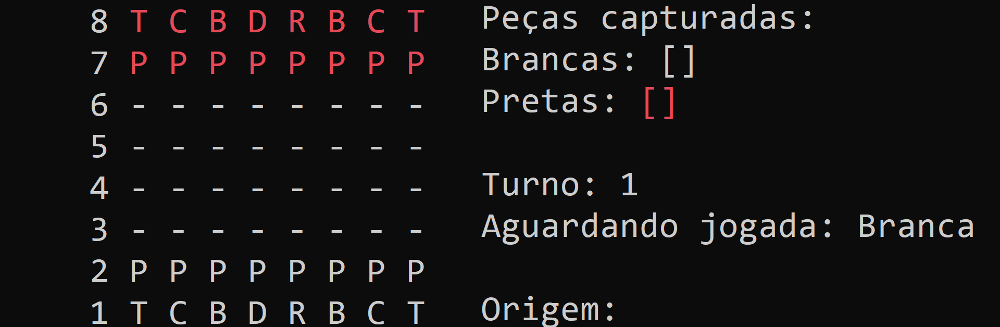

<h1 align="center">
    
</h1>

  <a href="#-instalação-e-execução">Instação e execução</a>&nbsp;&nbsp;&nbsp;|&nbsp;&nbsp;&nbsp;
  <a href="#-jogadas-especiais">Jogadas especiais</a>&nbsp;&nbsp;&nbsp;|&nbsp;&nbsp;&nbsp;
  <a href="#-projeto">Projeto</a>

 

  

## 🎓 Instalação e execução

1. Faça um clone desse repositório;
2. Entre na pasta rodando `cd Chess`;

### Console

3. Entre na subpasta 'Chess/Chess' rodando `cd Chess`;
4. Rode `dotnet run` para iniciar o programa (é necessário ter a tecnologia .NET já instalada);
5. Aguarde a compilação do código e estará pronto para uso.

## ♟️ Jogadas especiais

O aplicativo possui a lógica das jogadas especiais Roque Pequeno, Roque Grande, En Passant e Promoção plenamente implementadas. É possível realizá-las em ambos os lados do tabuleiro.

## 💻 Projeto

O sistema de jogo de xadrez é um aplicativo simples feito com base no curso "C# COMPLETO Programação Orientada a Objetos + Projetos" do professor Nelio Alves, em parceria com a plataforma Udemy. O sistema utiliza a linguagem C# e é um aplicativo de console .NET. O sistema contempla toda a lógica de um jogo de xadrez comum.

---

Feito com ♥ by Sofia Rodrigues Ferreira :wave: [Contato](https://www.linkedin.com/in/sofiarodfer/)
